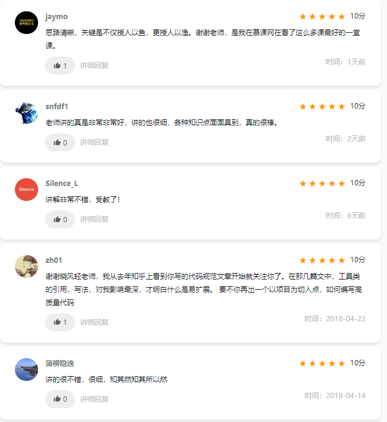

# Ajax跨域完全讲解

**慕课网视频倾情讲解，从原因到底层原理分析，好评如潮！欢迎观看，[去看看](https://www.imooc.com/learn/947)**

## 大纲

## 跨域产生原因
* 必须是浏览器上发出的请求

其实就是浏览器多管闲事，觉得【可能】有安全问题，所以不允许。非浏览器发生的请求没有这个问题，如你在java代码中掉任何域都不可能报这个问题。

* 必须是XMLHttpRequest请求

直接访问肯定是不会错误的。

* 跨域

就是协议，域名，端口任何一个不同就算跨域。

> 重点：跨域和异步请求是浏览器的概念，服务器没有跨域和异步请求的概念。

## 解决思路
针对产生跨域的3个条件，我们有对应的解决方法。

* 针对浏览器，指定参数让浏览器闭嘴，不检查。

以chrome为例，增加参数--disable-web-security --user-data-dir=C:\MyChromeDevUserData 启动chrome即可解决，由于实际意义不大，不单独演示，大家有兴趣本机自己尝试即可。

* 针对XMLHttpRequest请求，使用jsonp

jsonp是前后台的一个约定，约定了当请求带了指定参数的时候（默认是callback），返回的数据由json改成函数调用形式。jsonp弊端：
1. 服务器需要改动
2. 只支持get

* 针对跨域，有2种解决方式

先了解最基本j2ee架构。2种思路：

1. 支持跨域（被调用方解决）

基于http协议关于跨域的相关规定，再http头上返回相关支持跨域的信息。可以在Serverlt容器上用Filter上增加或者在中间服务器的nginx/apache上增加

2. 隐藏跨域（调用方解决）

就是配置反向代理，让跨域请求从请求方的中间服务器转出去。

:::tip
这2种方式虽然最后可能都是修改中间服务器的nginx/apache，但出发点是完全不一样的，修改的配置内容也是完全不一样的。一定要理清楚！
:::

## github地址

[https://github.com/xwjie/AjaxDemo](https://github.com/xwjie/AjaxDemo)

## 课程地址

点击图片进入视频学习

