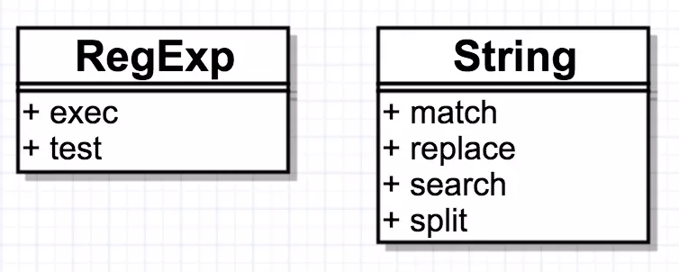

# javascript

## js的6个正则方法


## 大写每个单词的首字母

使用replace（）匹配每个单词的第一个字符，并使用toUpperCase（）来将其大写。

```js
const capitalizeEveryWord = str => str.replace(/\b[a-z]/g, char => char.toUpperCase());
// capitalizeEveryWord('hello world!') -> 'Hello World!'
```

## 用 Object.keys 代替 for..in

eslint: for..in loops iterate over the entire prototype chain, which is virtually never what you want. Use Object.{keys,values,entries}, and iterate over the resulting array  no-restricted-syntax

