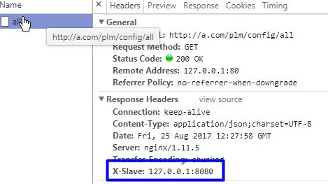

# 日志打印

开发中日志这个问题，每个公司都强调，也制定了一大堆规范，但根据实际情况看，效果不是很明显，主要是这个东西不好测试和考核，没有日志功能一样跑啊。

但编程活久见，开发久了，总会遇到“这个问题生产环境上能重现，但是没有日志，业务很复杂，不知道哪一步出错了？” 这个时候，怎么办？ 还能怎么办，发个版本，就是把所有地方加上日志，没有任何新功能，然后在让用户重现一遍，拿下日志来看，哦，原来是这个问题。

有没有很熟悉的感觉？


还有一种情况，我们系统有3*5=15个节点，出了问题找日志真是痛苦，一个一个机器翻，N分钟后终于找到了，找到了后发现好多相似日志，一个一个排查；日志有了，发现逻辑很复杂，不知道走到那个分支，只能根据逻辑分析，半天过去了，终于找到了原因。。。一个问题定位就过去了2个小时，变更时间过去了一半。。。

## 日志要求

所以我对日志的最少有以下2点要求：

1 能找到那个机器

2 能找到用户做了什么


## 配置nginx

针对第一点，我修改了一下nginx的配置文件，让返回头里面返回是那个机器处理的。

nginx的基本配置，大家查阅一下资料就知道。简单配置如下（生产环境比这个完善）


效果如图，返回了处理的节点：



第二点，要知道用户做了什么。用户信息是很重要的一个信息，能帮助海量日志里面能快速找到目标日志。一开始要求开发人员打印的时候带上用户，但是发现这个落地不容易，开发人员打印日志都经常忘记，更加不用说日志上加上用户信息，我也不可能天天看代码。所以找了一下log4j的配置，果然log4j有个叫MDC(Mapped Diagnostic Context)的类（技术上使用了ThreadLocal实现，重点技术）。具体使用方法请自行查询。具体使用如下：

## UserFilter

filter中得到用户信息，并放入MDC，记住filter后要清理掉（因为tomcat线程池线程重用的原因）。

```java
/**
 * 用户信息相关的filter
 * 
 * @author 晓风轻 https://xwjie.github.io/PLMCodeTemplate/
 *
 */
public class UserFilter implements Filter {

  @Override
  public void init(FilterConfig filterConfig) throws ServletException {

  }

  @Override
  public void doFilter(ServletRequest request, ServletResponse response,
      FilterChain chain) throws IOException, ServletException {

    // 得到用户个人相关的信息（登陆的用户，用户的语言）
    fillUserInfo((HttpServletRequest) request);

    try {
      chain.doFilter(request, response);
    } finally {
      // 由于tomcat线程重用，记得清空
      clearAllUserInfo();
    }
  }

  private void clearAllUserInfo() {
    UserUtil.clearAllUserInfo();
  }

  private void fillUserInfo(HttpServletRequest request) {
    // 用户信息
    String user = getUserFromSession(request);

    if (user != null) {
      UserUtil.setUser(user);
    }

    // 语言信息
    String locale = getLocaleFromCookies(request);

    // 放入到threadlocal，同一个线程任何地方都可以拿出来
    if (locale != null) {
      UserUtil.setLocale(locale);
    }
  }

  private String getLocaleFromCookies(HttpServletRequest request) {
    Cookie[] cookies = request.getCookies();

    if (cookies == null) {
      return null;
    }

    for (int i = 0; i < cookies.length; i++) {
      if (UserUtil.KEY_LANG.equals(cookies[i].getName())) {
        return cookies[i].getValue();
      }
    }

    return null;
  }

  private String getUserFromSession(HttpServletRequest request) {
    HttpSession session = request.getSession(false);

    if (session == null) {
      return null;
    }

    // 从session中获取用户信息放到工具类中
    return (String) session.getAttribute(UserUtil.KEY_USER);
  }

  @Override
  public void destroy() {

  }

}
```

## 用户工具类

用户信息放入MDC：

```java
/**
 * 用户工具类
 * 
 * @author 晓风轻 https://xwjie.github.io/PLMCodeTemplate/
 *
 */
public class UserUtil {

  private final static ThreadLocal<String> tlUser = new ThreadLocal<String>();

  private final static ThreadLocal<Locale> tlLocale = new ThreadLocal<Locale>() {
    protected Locale initialValue() {
      // 语言的默认值
      return Locale.CHINESE;
    };
  };

  public static final String KEY_LANG = "lang";

  public static final String KEY_USER = "user";

  public static void setUser(String userid) {
    tlUser.set(userid);

    // 把用户信息放到log4j
    MDC.put(KEY_USER, userid);
  }

  /**
   * 如果没有登录，返回null
   * 
   * @return
   */
  public static String getUserIfLogin() {
    return tlUser.get();
  }

  /**
   * 如果没有登录会抛出异常
   * 
   * @return
   */
  public static String getUser() {
    String user = tlUser.get();

    if (user == null) {
      throw new UnloginException();
    }

    return user;
  }

  public static void setLocale(String locale) {
    setLocale(new Locale(locale));
  }

  public static void setLocale(Locale locale) {
    tlLocale.set(locale);
  }

  public static Locale getLocale() {
    return tlLocale.get();
  }

  public static void clearAllUserInfo() {
    tlUser.remove();
    tlLocale.remove();

    MDC.remove(KEY_USER);
  }
}
```

## log4j配置

增加用户信息变量，%X{user}

```xml
<!-- Appenders -->
<appender name="console" class="org.apache.log4j.ConsoleAppender">
  <param name="Target" value="System.out" />
  <layout class="org.apache.log4j.PatternLayout">
    <param name="ConversionPattern"
      value="[%t]%-d{MM-dd HH:mm:ss,SSS} %-5p:%X{user} - %c - %m%n" />
  </layout>
</appender>
```

## 日志要求

我做好上面2步后，对开发人员的日志只有3点要求：

1. 修改（包括新增）操作必须打印日志

大部分问题都是修改导致的。数据修改必须有据可查。

2. 条件分支必须打印条件值，重要参数必须打印

尤其是分支条件的参数，打印后就不用分析和猜测走那个分支了，很重要！如下面代码里面的userType，一定要打印值，因为他**决定了代码走那个分支**。


3. 数据量大的时候需要打印数据量

前后打印日志和最后的数据量，主要用于分析性能，能从日志中知道查询了多少数据用了多久。这点是建议。自己视情况而决定是否打印，我一般建议打印。


## 日志效果图

加上 我的编码习惯 - Controller规范 这篇文章的AOP，最后的日志如下：


其实日志的级别我到不是很关注，还没有到关注这步到时候。开发组长需要做好后勤工作（前面2步），然后制定简单规则，规则太多太能落实了。

## 新手建议

日志这个东西，更多是靠自觉，项目组这么多人，我也不可能一个一个给大家看代码，然后叫你加日志。我分析了一下，为什么有些人没有打印日志的习惯，说了多次都改不过来。我建议大家养成下面的习惯，这样你的日志就会改善多了！


1.不要依赖debug，多依赖日志。

别人面对对象编程，你面对debug编程。有些人无论什么语言，最后都变成了面对debug编程。哈哈。这个习惯非常非常不好！debug会让你写代码的时候偷懒不打日志，而且很浪费时间。改掉这个恶习。


2. 代码开发测试完成之后不要急着提交，先跑一遍看看日志是否看得懂。

日志是给人看的，只要热爱编程的人才能成为合格程序员，不要匆匆忙忙写完功能测试ok就提交代码，日志也是功能的一部分。要有精益求精的工匠精神！


